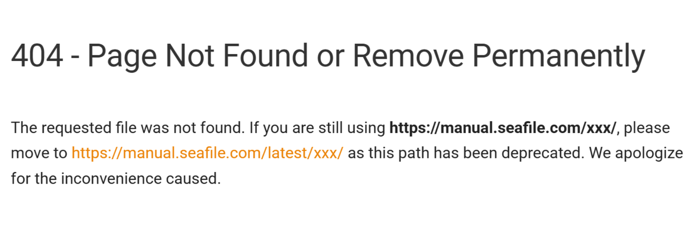

# Issue Report
Project: *Broken documentation links in README pointing to manual.seafile.com*

Date Found: *2026-04-15*

Date Reported: *2026-04-15*

Status: Issue Closed

## 1. Summary

Several documentation links in the Seafile README point to manual.seafile.com and return 404 errors.

## 2. Context

During the exploratory stage of the project, this was discovered upon trying the supplmental resources linked in the README.

## 4. Steps to Reproduce

1. Open the Seafile README.
2. Scroll to the documentation section.
3. Click any link pointing to manual.seafile.com.
4. Observe the 404 error.

## 5. Expected Behavior

Documentation pages should load successfully and provide the correct content.

## 6. Actual Behavior

All links pointing to manual.seafile.com return a 404 Not Found error.

## 7. confirmation Process

Checks performed:
Reproduced the issue multiple times to rule out transient errors.
- Tested the links in different browsers (Chrome/Firefox) to confirm it wasn’t a local caching or extension issue.
- Verified the URLs manually by navigating to the base domain (manual.seafile.com) and checking if the structure matched the linked paths.
- Compared the README links with the current structure of the Seafile Manual to confirm the paths are outdated.
- Searched existing issues and discussions to ensure this wasn’t already reported or explained as intentional.

## 8. Root Cause (Hypothesis)

Highly likely that the site's structure changed over the years. Last update to the README was two years ago.

## 9. GitHub Issue Link

~~~
https://github.com/haiwen/seafile/issues/3025
~~~

## 10. Attachments / Screenshots

## 11. Follow‑Up Notes

- 2026‑04‑15 — Issue filed.
- 2026‑04‑15 — Issue closed.
